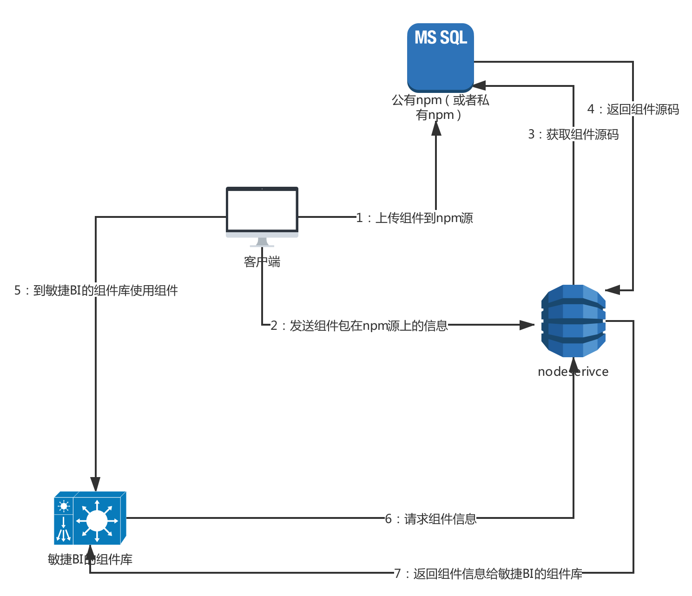
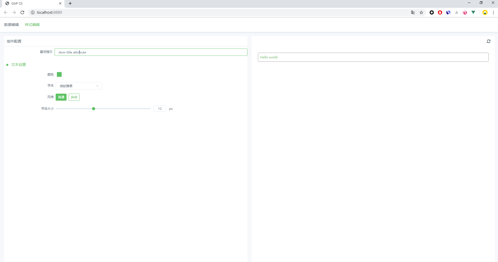
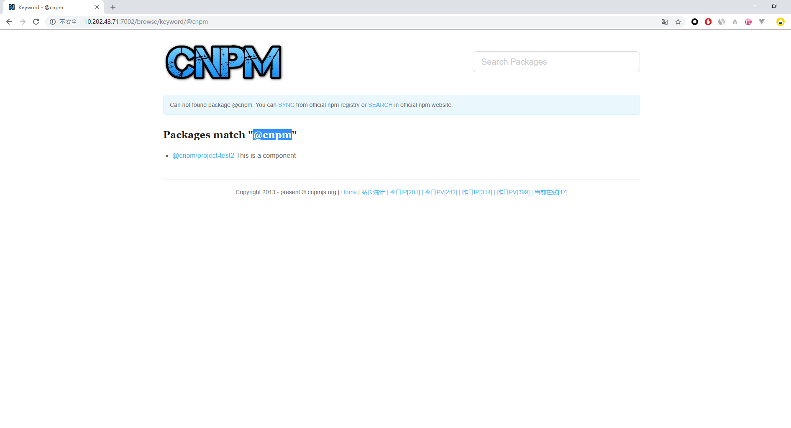

This is a tool for platfrom build external component

# 整体流程



# 使用步骤

## 0 下载工具(require)
```
// 全局安装cli工具
npm install -g ty-clitools

// 安装ty-clitoos后，就可以在任何目录使用ty命令
ty

Usage: ty-clitool [command] [options]

Options:
  -V, --version              output the version number
  -h, --help                 output usage information

Commands:
  init [options] <app-name>  Generate a template for project
  generate                   Generate componets json
  sync [options]             Updata componnet Info to platform
  serve [entry]              server a .js file in production mode with zero config
  build [entry]              build a .js file in production mode with zero config
```


## 1 初始化项目(require)
```
// 生成项目文件夹自动下载依赖
ty init project-test2

? name:(project-test2) 
? description: (This is a component)
downloading template
installing dependens

```

## 2 本地开发(rquire)
```
// 开启本地服务进行本地调试开发
ty serve
```


## 3 选择私有npm源(option)
```
// registry的具体url随着不同环境而不同
npm config set registry {{URL}}

// 初次使用：登录私有npm源
npm login
username: admin
password: admin
e-mail: admin@cnpmjs.org

// 将包名的改为带有特殊scope的名字如：@cnpm
 "name": "@cnpm/project-test2",
```

## 4 上传项目(require)
```
下面有两种上传项目到平台的方式，两种都支持。


(1) 快速上传项目
// 待项目开发完毕后上传最新版本报到npm以及可视化平台
// 注意初次使用需要登录npm
npm run upload

(2)分步骤上传项目
// 上传组件到npm
npm publish
// 生成当前组件信息
ty generate
// 将当前组件信息同步到默认平台（这里需要注意的可以通过设置host选项来选择平台ty sync --host=realHostName
ty sync 
```

## 5 在npm查看包(option)
### 这里分两种情况：  
* （1）没有设置私有npm源的直接上 [npm](https://www.npmjs.com/)根据包名搜索
* （2）第三步中设置了npm源的，上私有源（根据不同环境地址不一样）根据包名搜索    


